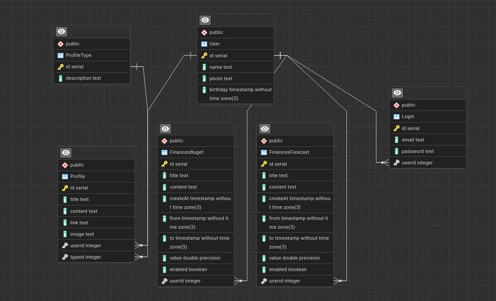

# DevOps

Pipelines and schemas to my API and Database.


## Sobre

Utilizei este repo para consolidar meus estudos de devops e docker, armazenando todo o planejamento para construir minha aplicação de planejamento pessoal, assim como arquitetura dos serviços, banco de dados e deploy.

> Conto mais detalhes no [Front-end](https://github.com/jsi1v4/my-planning-app) e Back-end [NodeJS](https://github.com/jsi1v4/api-node), [.NET](https://github.com/jsi1v4/api-csharp) e [Java](https://github.com/jsi1v4/api-java) 🖖😎.

## Requisitos

- [Docker](https://www.docker.com)

## Tecnologias utilizadas

O projeto foi desenvolvido utilizando as seguintes tecnologias:

- [Docker](https://www.docker.com)
- [PostgreSQL](https://www.postgresql.org)
- [PostgreAdmin](https://www.pgadmin.org/)

## Como baixar e executar o projeto

### Clonar o repo

```sh
git clone https://github.com/jsi1v4/devops
```

### Executar em localhost

```sh
docker-compose up
```

### Buildar projeto

```sh
docker-compose build
```

## Database



[**Voltar ao inicio**](#devops)

---

Keep calm and code on 🤘.
